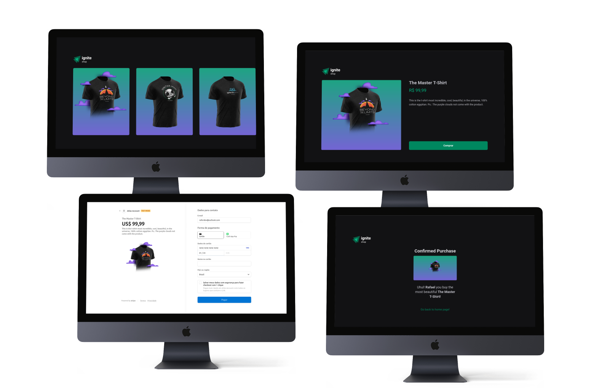

<p align="center">
  <a href="https://ignite-shop-jade.vercel.app/">
 </a>
</p>

<h3 align="center"></h3>

<p align="center">


</p>

---



---

<p align="center"> This app was created on Rocketseat course and was build to improve the NectJS fundamentals, like, filesystem routing, SEO, prefeching links and more. Is a basic sales page with some products with you can test the checkout process.
</p>

## 📝 Table of Contents

- [About](#about)
- [Getting Started](#getting_started)
- [Usage](#usage)
- [Built Using](#built_using)
- [Authors](#authors)

## 🧐 About <a name = "about"></a>

This project is the fourth part of Rocketseat ReactJs course with i am using to stay solid with the most actual and best practices on frontend projects. Now i'm using the NextJS fundamentals to generate a SSG and SSR parts of an ReactJS project. This is a sales webpage and the products were registered on the [Stripe](https://stripe.com/) platform, and this page is builded to improve all steps to buy a real product.

## 🏁 Getting Started <a name = "getting_started"></a>

You can clone the project and start on your local host or open the site hospeded <a href="https://ignite-shop-jade.vercel.app/">here</a>

Clone

```
git clone https://github.com/raferdev/ignite_shop
```

Install Dependencies

```
npm i
```

Start Server

```
npm run dev
```

The browser will remote open on the local link on port 300 (usually in NextJS projects). Exemple .:

```
http://localhost:3000
```

## 🎈 Usage <a name="usage"></a>

You can add click and slide horizontally the products on homepage.

- You can select one of them and go to product page.

- See the details of the product.
- Click on buy product.
- You will see the checkout page ( you can use a random informations to register your payment and [here](https://stripe.com/docs/testing) have some numbers you can use to test) .
- After this you will go to the sucess page, and will see the name you registered and your product name too.

## ⛏️ Built Using <a name = "built_using"></a>

- [HTML](https://developer.mozilla.org/pt-BR/docs/Web/HTML) - Markup Language
- [Stitches](https://stitches.dev/) - CSS-in-JS
- [Typescript](https://developer.mozilla.org/pt-BR/docs/Web/typescript) - Javascript with super powers language
- [ReactJS](https://pt-br.reactjs.org/) - Javascript Superset Library
- [NextJS](https://nextjs.org/) - React Framework

## ✍️ Authors <a name = "authors"></a>

- [@raferdev](https://github.com/raferdev) - build
- [@rocketseat](https://github.com/rocketseat) - idea
